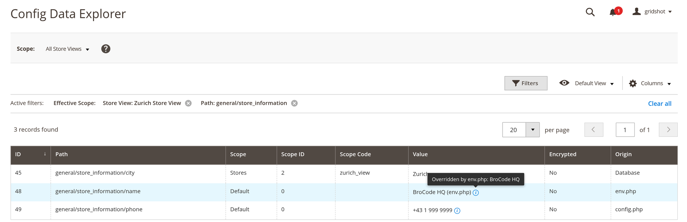
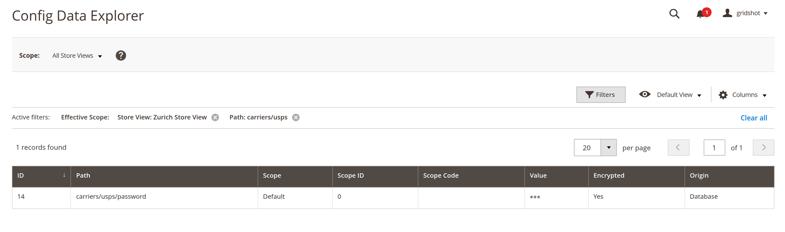
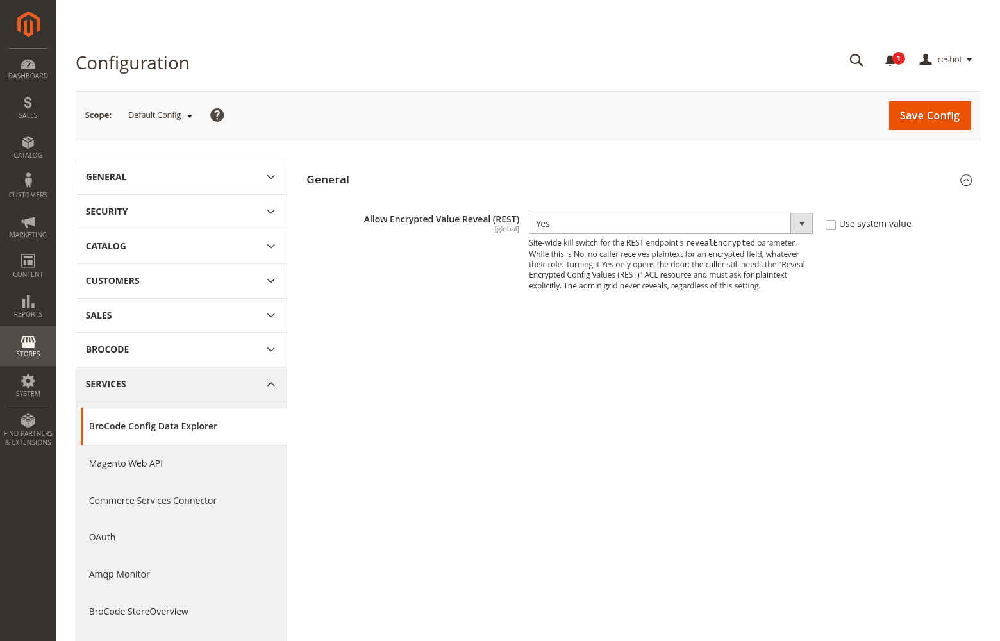

# BroCode_ConfigExplorer

Read-only admin grid and REST API over `core_config_data`, with encrypted values
redacted by default in both.

```bash
composer require brocode/module-config-explorer
bin/magento module:enable BroCode_ConfigExplorer
bin/magento setup:upgrade
```

## What this is

- An admin grid at **Stores → Settings → Config Data Explorer**, filterable by path,
  scope, and scope ID. Encrypted values always render as `***` here — there is no
  reveal control in the grid at all, by design.
- `GET /V1/config-explorer/config`, the same filters over REST, plus an optional
  `revealEncrypted` flag that is refused unless three independent gates all open.
- No write path anywhere. There is no save, no delete, and no `POST`/`PUT`/`DELETE`
  route; the resource model binds to the native table for reads only.



*Stock 2.4.8-p5, filtered to one path prefix at a store view. `city` is a real store-view row; `name` and `phone` look like ordinary default rows but are shadowed by `env.php` and `config.php`. Origin names the file, and the hint names the database value it is shadowing.*

## Why the grid never reveals

Redaction in the grid is unconditional, even for a user who holds the reveal ACL.
Plaintext is available only through an explicit REST call, which leaves a request
trace, rather than through a checkbox that stays on in a shared admin session.



*`carriers/usps/password` shows `***` with Encrypted `Yes`. There is no reveal control on this screen for any role.*

## Access model

Three gates, all required, checked in this order:

| Gate | Where | Default |
|---|---|---|
| `brocode_config_explorer/general/allow_encrypted_reveal` | **Stores → Configuration → Services → BroCode Config Data Explorer** | No |
| `BroCode_ConfigExplorer::config_view_encrypted` | ACL resource | Granted to no role |
| `revealEncrypted=true` | REST request parameter | `false` |

The toggle is checked before the ACL, so a caller who holds the resource on an
installation with the switch off is refused. Asking for plaintext without being
allowed it raises `AuthorizationException` — a caller never receives a silently
redacted response when they explicitly asked to see the real value.



*The setting lives under Services, beside Magento Web API and OAuth, rather than in a vendor-specific top-level tab.*

## REST usage

```bash
# redacted, the default
curl -X GET "https://example.com/rest/V1/config-explorer/config?path=braintree" \
     -H "Authorization: Bearer $TOKEN"

# plaintext, only with the toggle on and the ACL resource granted
curl -X GET "https://example.com/rest/V1/config-explorer/config?path=braintree&revealEncrypted=true" \
     -H "Authorization: Bearer $TOKEN"
```

Every entry carries `is_encrypted`, so a consumer can tell a redacted `***` apart
from a value that genuinely is `***`, and apart from an empty one.

## How encrypted fields are detected

`Model/Config/EncryptedPathResolver` walks the merged `system.xml` structure and
matches any field whose `backend_model` is
`Magento\Config\Model\Config\Backend\Encrypted` **or a subclass of it**, honouring
`<config_path>` overrides when a field stores under a different path than it is
declared at.

Magento core answers a narrower version of the same question in
`Structure::getFieldPathsByAttribute()`, which `Magento\EncryptionKey` uses to find
rows to re-encrypt on a key rotation. This module deliberately does not reuse it:

1. Core compares `backend_model` with `==` against one class name, so a **subclass**
   of `Encrypted` is never returned. In a re-encrypt routine that is a missed row; in
   a redaction routine it is a leaked secret.
2. Core builds structure paths and ignores `<config_path>`, so a field storing under
   an overridden path would be matched against the wrong `core_config_data` row.

## Limitations

- **Detection is declaration-based.** A field is recognised as encrypted only when its
  declared `backend_model` extends `Encrypted`. A custom backend model that calls the
  encryptor without extending it is invisible here and its value will be shown in
  full. Audit your own `system.xml` before treating this as a security boundary —
  [BroCode_EncryptedConfigAudit](https://github.com/brosenberger/module-encrypted-config-audit)
  scans for the related declaration defect.
- **`getList()` takes scalar filters, not `SearchCriteriaInterface`.** Deliberate for
  v1: the filters map to the three columns that matter for this table. There is no
  paging on the REST response.
- Targets Magento 2.4.6+ on PHP 8.1–8.4. Not tested below 2.4.6.

## Verification status

The encrypted-path resolver is covered by a logic test over the merged-structure shape
(exact class, subclass, leading backslash, `config_path` override, nested groups,
unloadable class, empty structure). The grid, the REST route, and the ACL wiring have
not yet been exercised against a running Magento instance.
